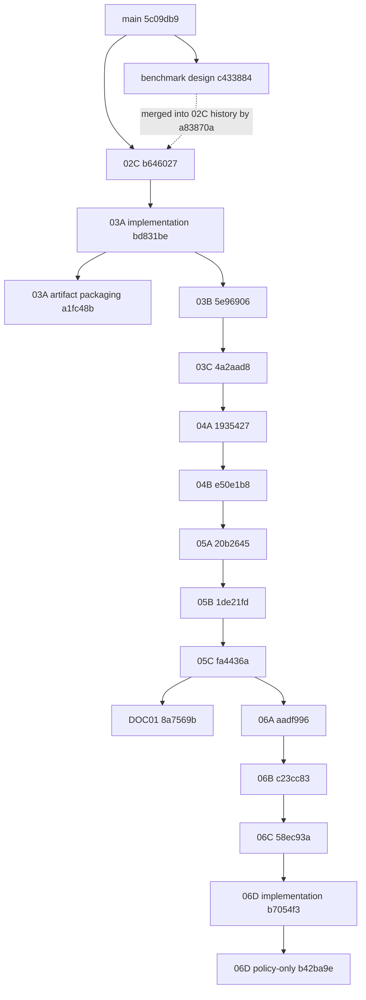

# DM-Slicer Branch Dependency DAG

Generated from the local Git object database on 2026-09-10. Goal numbering is descriptive only; every edge below is backed by commit parents or `git merge-base --is-ancestor`.

## Graph



The `03A artifact packaging` and `03B` nodes are sibling children of `bd831be`. The graph deliberately does not draw an edge from `a1fc48b` to 03B.

## Branch tips and merge bases

All branches have `main@5c09db91a5a2cf363beb4750384f532a3308f995` as their merge-base with `main`, because none of these Goal branches has been integrated into `main`.

| Goal | Branch / integration candidate | Tip or candidate commit | Parent relationship to prior Goal | Merge-base with prior Goal | Inherits prior tip? |
|---|---|---|---|---|---|
| 02C | `fix/case01-foundation` | `b6460270f2932b8bc2bbe1bcb4c052daba1ae277` | descends from `main`; includes the benchmark-design merge `a83870a` | `5c09db91a5a2cf363beb4750384f532a3308f995` | yes, for `main` |
| 03A implementation | `feat/contact-canonical-planar-dimensions` core | `bd831be5664dda92b9d9d0e3dba71d941fce0090` | direct child of 02C tip | `b6460270f2932b8bc2bbe1bcb4c052daba1ae277` | yes |
| 03A packaging | `feat/contact-canonical-planar-d` tip | `a1fc48b7efbd7f21c227b8da36aa5542b9f130b7` | direct child of 03A implementation | `bd831be5664dda92b9d9d0e3dba71d941fce0090` | yes, from core only |
| 03B | `feat/contact-canonical-analytic-curves` | `5e96906f4103f103b9522a4c6e8462ad238c74af` | direct child of 03A implementation, not packaging | `bd831be5664dda92b9d9d0e3dba71d941fce0090` | **no** for 03A branch tip `a1fc48b` |
| 03C | `feat/contact-canonical-interface-topology` | `4a2aad8d926ea14d9526e2b7a1428a9d652b87f9` | descends from 03B tip | `5e96906f4103f103b9522a4c6e8462ad238c74af` | yes |
| 04A | `feat/contact-partition-and-union` | `19354277520c40bf61193525cbf213946dbbb511` | descends from 03C tip | `4a2aad8d926ea14d9526e2b7a1428a9d652b87f9` | yes |
| 04B | `feat/cylinder-partition-and-union` | `e50e1b8e7735f29a15175929000e799a54a83451` | descends from 04A tip | `19354277520c40bf61193525cbf213946dbbb511` | yes |
| 05A | `feat/contact-tolerance-pilot` | `20b26450dffee96427a4375c310b8b303c1c9812` | descends from 04B tip | `e50e1b8e7735f29a15175929000e799a54a83451` | yes |
| 05B | `feat/contact-scale-covariance-pilot` | `1de21fd41aac05e437f6ebb839344af171b6e878` | descends from 05A tip | `20b26450dffee96427a4375c310b8b303c1c9812` | yes |
| 05C | `feat/contact-fixed-tolerance-pilot` | `fa4436a2784574ffa336e87a9df898c35780a587` | descends from 05B tip | `1de21fd41aac05e437f6ebb839344af171b6e878` | yes |
| 06A | `feat/planar-gap-assembly-correction` | `aadf996a05bf87efee862964141b6aeb7f872baf` | descends from 05C tip | `fa4436a2784574ffa336e87a9df898c35780a587` | yes |
| 06B | `feat/planar-partial-overlap-correction` | `c23cc83a4c60620a8210e9aad01fb7adc1c72bde` | direct child of 06A tip | `aadf996a05bf87efee862964141b6aeb7f872baf` | yes |
| 06C | `feat/planar-multipatch-interface-correction` | `58ec93a67d8214c69bc92d5710c60d91aa1fe30c` | descends from 06B tip | `c23cc83a4c60620a8210e9aad01fb7adc1c72bde` | yes |
| 06D geometry | `feat/orientation-invariant-planar-correction` geometry candidate | `b7054f303896aa4a0762248a0b54686d8e733ead` | direct child of 06C tip | `58ec93a67d8214c69bc92d5710c60d91aa1fe30c` | yes |
| 06D policy | same feature branch, policy history only | `b42ba9e7b6efc6dd5a9dd9f7b1584b5a89066f8b` | direct child of 06D geometry | `b7054f303896aa4a0762248a0b54686d8e733ead` | yes, but not a geometry-run commit |
| DOC01 | `docs/geometry-portability-playbook` | `8a7569bb43c9187a8aad4d548af846158b728140` | branches from the 05C line | `fa4436a2784574ffa336e87a9df898c35780a587` | no for 06A–06D |

## Command evidence

The following command families produced the table:

```powershell
git rev-parse <branch>
git show -s --format='%H|%P|%s' <commit>
git merge-base <prior-branch> <branch>
git merge-base --is-ancestor <prior-tip> <branch>
```

Targeted negative ancestry checks:

```text
git merge-base --is-ancestor a1fc48b 5e96906  -> exit 1
git merge-base --is-ancestor a1fc48b b7054f3  -> exit 1
git merge-base --is-ancestor 8a7569b aadf996  -> exit 1
git merge-base --is-ancestor b7054f3 b42ba9e  -> exit 0
```

## Conclusions for future main integration

1. The executable research chain is 02C → 03A core `bd831be` → 03B → 03C → 04A → 04B → 05A → 05B → 05C → 06A → 06B → 06C → 06D geometry `b7054f3`.
2. Merging the 06D feature tip would also import policy commit `b42ba9e`; geometry integration must therefore be evaluated separately from policy integration.
3. The 03A artifact-packaging commit `a1fc48b` is not present in 03B–06D. Its artifacts cannot be assumed to accompany a later-Goal merge and require a separate evidence-preservation decision.
4. DOC01 is a side branch from the 05C line and cannot be treated as documentation of inherited 06A–06D behavior.
5. This report authorizes no batch merge. Each future main integration requires a dedicated task that respects the real ancestry and evidence state above.
