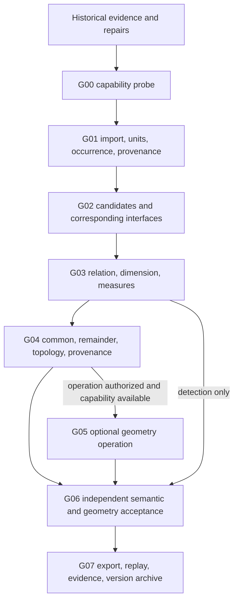

# DM-Slicer workflow and backend portability map

This directory turns the implemented DM-Slicer stages and their confirmed
failure lessons into a reusable migration contract. It describes a workflow; it
is **not** an execution engine, a claim that every design is implemented, or an
authorization to modify geometry.

Documentation baseline: `fa4436a2784574ffa336e87a9df898c35780a587`
(`fix: bind A01 tolerance roles explicitly`). No FreeCAD run or full regression
was repeated while writing this map. A historical report of a passing run is
therefore `DOCUMENTED_VALIDATION`, not current-run proof.

## Status vocabulary

| Label | Meaning |
|---|---|
| `DESIGN_ONLY` | A contract or intended design exists; the capability is not implemented here. |
| `IMPLEMENTED` | Reachable code exists at the documentation baseline, within the stated case/version boundary. |
| `DOCUMENTED_VALIDATION` | A tracked document records a prior validation result; this documentation task did not rerun it. |
| `EVIDENCE_AVAILABLE` | A tracked machine-readable result or immutable input/truth bundle is present. |
| `KNOWN_LIMITATION` | A confirmed scope or behavior boundary must be preserved. |
| `PLANNED` | A later stage is identified but is not part of the fixed baseline. |
| `NOT_VERIFIED` | This task did not establish the claim, or current evidence is insufficient. |

Several labels may apply to one stage. Source code alone never upgrades
verification status, and an old `PASS` never becomes a new backend `PASS`.

## Where to start

1. Read this page for history and scope.
2. Load only the relevant `G00`--`G07` entry from
   [`workflow.json`](workflow.json).
3. Read the semantic contract in [`backend_contract.md`](backend_contract.md).
4. Load only the applicable `PIT-*` rules from [`pitfalls.md`](pitfalls.md).
5. For a porting task, invoke `dmslicer-backend-port` and confirm that its
   `SKILL.md` was loaded before mapping APIs.

Existing runnable entry points use `py -m dmslicer ...` with `PYTHONPATH=src`
when the package is not installed. The 05B code has **no unified CLI entry** at
this baseline; use its documented Python functions or add a separately approved
entry-point task rather than inventing a command. The 05C module has its own
entry point: `py -m dmslicer.contact_fixed_tolerance_pilot_05c {generate|run|revalidate}`.

## Two maps, kept separate

The historical map says what this repository did. The `G*` map is the stable,
backend-neutral capability decomposition. Dependencies are conditional: a
detection-only task does not require or authorize `Fuse`; geometric fact,
material semantics, and action permission remain separate records.

## Historical stage map

`In main?` is derived from the Git graph, not stage ordering. At this baseline,
`origin/main` is `5c09db9`; none of the implementation stages below has entered
main. The fixed documentation baseline follows the 02B/foundation → 03A
implementation → 03B → 03C → 04 → 05 chain. The separate 03A release-artifact
commit `a1fc48b` and its outputs are not ancestors of this baseline.

| Stage | Purpose and delivered capability | Actual entry / key input | Tests or evidence | Source commit(s) | Status, limits, main |
|---|---|---|---|---|---|
| Initialization and research freeze | Repository contract, legacy boundary, STEP/B-rep design. The earlier AMF prototype is a separate, dirty-at-snapshot historical baseline, not this repository's geometry authority. | `docs/research_v2/README.md`; no implementation entry | `docs/research_v2/00_legacy_baseline.md`; `docs/repository_initialization_report.md` | `2202501`, `5c09db9`, design branch merged into foundation at `a83870a` | `DESIGN_ONLY`, `EVIDENCE_AVAILABLE`; initialization is in main, later frozen-design merge is not. |
| 02B | CASE01 three-solid STEP import, candidate evidence, face common, stable identities, semantic source boundaries, repeatability and capability probe. | `py -m dmslicer capability-probe <output.json>`; `analyze-case01`; input `benchmarks/interface_case01/case01.step` | `tests/test_case01.py`; tracked STEP/expected/semantics | `7b424f5`, `e6d9a86` | `IMPLEMENTED`, `KNOWN_LIMITATION`: native Boolean history probe reports unavailable; not in main. |
| Foundation fixes | Harden CASE01 truth isolation, deterministic identity/provenance, coverage/repeatability; later 04B corrected an invalid hard-coded fixture hash without changing STEP bytes. | Same CASE01 entries | `tests/test_case01.py`; `docs/implementation/04b_case01_fixture_integrity.md` | `79f60fa`, `07655b8`, `b646027`, correction `e50e1b8` | `IMPLEMENTED`, `DOCUMENTED_VALIDATION`; not in main. |
| 03A | Semantic-free A01--A06 planar/point/edge/interference diagnostics with independently loaded truth. | `py -m dmslicer run-contact-canonical-suite benchmarks/contact_canonical_03a <output>` | `tests/test_contact_canonical_03a.py`; tracked fixtures. Separate evidence package: `a1fc48b` | `bd831be`; non-ancestor package `a1fc48b` | `IMPLEMENTED`; this baseline does not contain the separate release package; not in main. |
| 03B | A07--A09 cylindrical, spherical and conical analytic contact; geometric component grouping avoids treating a periodic seam as a disconnected patch. | `py -m dmslicer run-contact-canonical-analytic-suite benchmarks/contact_canonical_03b <output>` | `tests/test_contact_canonical_03b.py`; tracked fixtures | `5e96906` | `IMPLEMENTED`, `DOCUMENTED_VALIDATION`; limited to three constructed cases; not in main. |
| 03C | A11 disconnected patches and A12 annular patch topology, boundary loops, holes and many-to-many provenance. | `py -m dmslicer run-contact-canonical-interface-topology-suite benchmarks/contact_canonical_03c <output>` | `tests/test_contact_canonical_03c.py`; tracked fixtures | `1c227cf` | `IMPLEMENTED`; not a generic topology engine; not in main. |
| 03C A12 repair | Replaced `transformGeometry`-induced B-spline representation conversion with direct normalized analytic construction; retained strict existing thresholds. | 03C suite | `docs/implementation/03c_a12_analytic_geometry_fix.md`; A12 tests | `4a2aad8` | `IMPLEMENTED`, `DOCUMENTED_VALIDATION`; conclusion is scoped to this fixture path; not in main. |
| 04A | For A02/A08, split participating faces into common/remainder parts and optionally fuse copied solids; record shape and provenance checks. | `py -m dmslicer run-contact-partition-union-suite <output>` | `tests/test_contact_partition_union_04a.py` | `944d321` | `IMPLEMENTED`; operation is case-limited and requires authorization; not in main. |
| 04A2 | Corrected final validation gate and shape intent; added U01--U03 shell-fill cases with independent reference shapes and negative candidates. | `py -m dmslicer run-shell-fill-suite benchmarks/shell_fill_04a2 <output>` | `tests/test_shell_fill_04a2.py`; prior report says 83 tests passed | `1935427` (after policy commits `5c6b955`, `6ee8835`) | `IMPLEMENTED`, `DOCUMENTED_VALIDATION`; prior pass not rerun here; not in main. |
| 04B | U04--U06 cylindrical partition/union plus CASE01 fixture-integrity correction. | `py -m dmslicer run-cylinder-fit-suite benchmarks/cylinder_fit_04b <output>` | `tests/test_cylinder_partition_union_04b.py`; integrity note/test | `5ce13c7`, `e50e1b8` | `IMPLEMENTED`, `DOCUMENTED_VALIDATION`; not in main. |
| 05A | A01/A07 fixed-scale, 15-point engineering-tolerance pilot; exact geometry, engineering state and direct Fuse are separate fields. | `py -m dmslicer run-contact-tolerance-pilot-suite benchmarks/contact_tolerance_pilot_05a <output>` | `tests/test_contact_tolerance_pilot_05a.py`; tracked 30 sample bundles | `312bc7d`, `20b2645` | `IMPLEMENTED`; discrete pilot only, no tolerance-aware repair; not in main. |
| 05B | A01/A07 co-scaled `tauE`, 90 samples; later separates native absolute and scale-normalized validation. | Python API `generate_contact_scale_covariance_pilot`, `run_contact_scale_covariance_pilot`, `revalidate_contact_scale_covariance_pilot`; no unified CLI | `tests/test_contact_scale_covariance_pilot_05b.py`; tracked bundles; revalidation counts are documented | `2fe54de`, `1de21fd` | `IMPLEMENTED`, `DOCUMENTED_VALIDATION`, `KNOWN_LIMITATION`: one normalized mismatch and 16 native-absolute overruns were retained; not in main. |
| 05C | A01/A07 fixed absolute `tauE` across three scales; retains out-of-domain and method-mismatch results. Later diagnosis and role-constrained A01 offset repair. | `py -m dmslicer.contact_fixed_tolerance_pilot_05c {generate|run|revalidate}` | `tests/test_contact_fixed_tolerance_pilot_05c.py`, role tests in `test_contact_tolerance_pilot_05a.py`; `artifacts/reference_results/05c_*.json`; archived q=-2/-4 bundles | `bb2eb89`, `5dd0359`, `52db2a8`, `0d681a9`, `fa4436a` | `IMPLEMENTED`, `EVIDENCE_AVAILABLE`, `DOCUMENTED_VALIDATION`; 21-case rerun retained one area overrun; no claim of all-green 05C; not in main. |
| 06A | Authorized planar-gap assembly correction after 05C. | No entry at this documentation baseline | Not read from its uncommitted worktree; independent branch commit is outside the fixed baseline | later branch `feat/planar-gap-assembly-correction` | `PLANNED` here and `NOT_VERIFIED`; optional future operation stage, not in main. |

## Three static migration rehearsals

These are documentation decision checks, not a real second-backend run or Agent
behavior evaluation.

1. **The new backend has no face-level Boolean history.** In G00 mark
   `NATIVE_BOOLEAN_HISTORY=UNSUPPORTED` with the probed symbols/API. Do not call
   the port fully provenance-complete. If the requested scope can be satisfied by
   actual source-pair face common, declare the narrower
   `DIRECT_FACE_COMMON` mode and validate it; otherwise stop or narrow scope.
2. **Geometry is equivalent but Face numbers and STEP bytes differ.** Accept or
   reject using independent truth and the G06 property set: relation/dimension,
   applicable measures, common/remainder, topology, coverage denominator,
   material/void differences, and required provenance. FaceN and serialized bytes
   are not equivalence criteria; input hashes still identify the concrete source
   files.
3. **A file was tracked in an old stage but current `outputs/` is absent.** Locate
   the introducing/relevant commit with `git log --all -- <repo-relative-path>` and
   inspect the blob with `git show <commit>:<path>`. Use tracked manifests,
   fixtures, tests, and evidence indexes; label an unavailable ignored output as
   unavailable rather than recreating or treating a summary as raw measurement.

Static result: all three questions have an explicit fail-closed decision.
Actual Agent behavior evaluation: `NOT_VERIFIED` / not executed for DOC01.

## Current implemented and unimplemented scope

Implemented, within the named fixtures and FreeCAD binding:

- STEP import/export and re-import; solids/faces, bounding boxes, placements
  represented by imported occurrences; stable content/occurrence-derived IDs;
- solid/face common, section, direct face provenance, relation dimension,
  length/area/volume, coverage, connected components, boundary loops and holes
  for the covered cases;
- case-limited `cut`, `fuse`, splitter removal, shape validity/closedness,
  independent reference comparisons, two-process replay and evidence JSON;
- explicit `UNSUPPORTED` behavior for missing/ambiguous A01 role binding, and a
  recorded `NOT_AVAILABLE` native Boolean-history capability.

Not implemented or not verified as a general capability:

- a backend-neutral runtime or adapter framework; arbitrary assemblies,
  occurrence graphs, units and placements across all STEP dialects;
- a second backend or independent-kernel validation; general face history when
  the binding does not expose it; arbitrary NURBS/non-manifold/large-model
  behavior;
- automatic motion/repair authorization, gradient fields, volumetric material
  fields, slicing, toolpaths or G-code.

## Maintenance rule

When a stage or repair lands, preserve its old report, add the new commit and
evidence reference to the affected `G*` step and `PIT-*` rule, and state whether
the result entered main. Never turn a prompt, plan, code path, ignored output,
or another backend with the same kernel into stronger evidence than it is.
